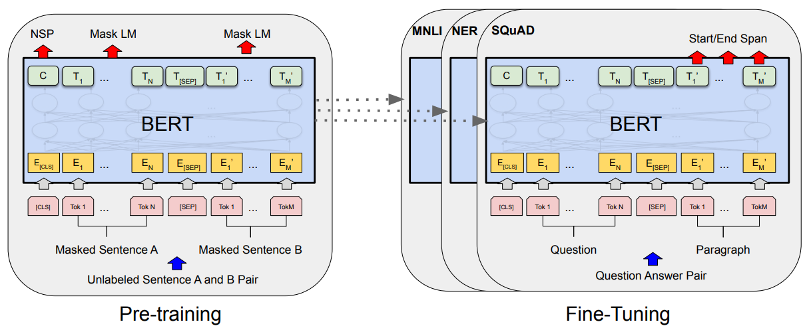
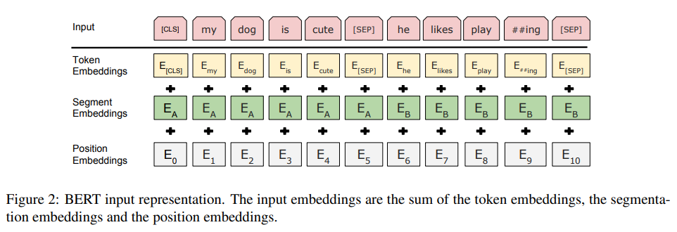

# BERT: Pre-training of Deep Bidirectional Transformers for Language Understanding

# 2019.9.10 part 1, pretrian 중심으로
- 본 내용은 사내 발표를 위해 논문 핵심 정리한 내용으로 공유합니다. 부족한 부분은 말씀주시기 바랍니다.

# Abstract

Bert는 “unlabeled text data의deep bidirectional representations”를 pretrain하는 모델이라 소개하고 있으며, 모든 layer에 left, right context를 conditioning 했다고 설명함.

one additional한 output layer만으로도 다양한 tasks에서 state-of-art models 달성

GLUE score 80.5% (이전보다 7.7 improvement), Multi MLI 86.7%, SQuAD v1.1 F1 to 93.2(absolute improvement) SQuAD v2.0 F1 83.1

# Introduction

Lange Model pre-training 접근 방법은 많은 NLP tasks에서 improvement를 가져왔음.

NLI : sentence-level tasks, question-answering, entity recognition : token-level tasks

이 경우, down stream tasks 접근방법을 사용하고 있음.

이전 GPT 논문의 경우, minimal한 task-specific parameters, share the same objective function을 썼으며 language model이 unidirectional하고 이를 한계라고 지적.

Bert의 경우 unidirectionality constraint 부분을 -mask of tokens- MLM pre-training objective을 제안.

이외에 next sentence prediction task를 jointly pretrain 했다고 함.

language representation에서 bi-directional한 pre-training 방법 강조.

pre-trained representations의 heavily-engineered task specific architectures필요를 줄일 수 있다는 점 특히 Bert의 경우 fine-tuning된 모델로 sentence, token level tasks에서 out performing 낸 점을 강조.

# 3 Bert

* two steps in framework : pre-training , fine-tuning
* fine tuning : initialize with pre-trained-parameter
* Model Architecture
  * multi-layer bidirectional Transformer encoder, L: number of layers H : hidden size A : number of self-attention heads
  * BERT base (L=12, H=768, A=12, total parameters=110M) BERT Large (L=24, H=1024, A=16, total parameters=340M)
  * BERT base는 gpt랑 똑같은 하이퍼파라미터지만 BERT는 bi-directional self-attention을 썼다는 점에서 다름.

# 3 BERT

* Input/Output Representations
  * sentence : arbitrary span of contiguous text, sequence : input token sequence(single sentence or two sentences packed together
  * use WordPiece embeddings  (vocabulary 30,000 token)
  * first token : always [CLS]  special token => final hidden state corresponding cls token, ; aggregation of sequence representation for classification task
  * Differ the sentence : special token [SEP], add learned embedding to every token (sentence A, B)
  * E : input embedding, C : final hidden vector of CLS token

# 3. BERT
3.1 Pre-training BERT

* Task #1 : Masked LM
* to obtain a bidirectional pre-trained model
  * left to right model, shallow left to right , right to left model < deep bi directional model
  * input을 복원시키기보다 마스크 씌운 토큰을 예측
* MASK token
  * random 15% in all word piece token
  * fine tuning 단계에서는 MASK token이 등장하지 않기 때문에 변형.
  * random으로 걸린 i에 대해 80% MASK token, 10% random token , 10% unchanged.

* Task #2 : Next Sentence Prediction
  * QA, NLI 모두 문장 간의 관계를 이해하는데 기초
  * pretrian 시,  Sentence A, B pair 학습
  * B문장의 경우 50%는 A문장과 관련이 있는 문장 (IsNext  label)
  * 50%는 random 문장으로 구성 (NotNext label)
* pre-training data
* BookCorpus(800M), WIkipedia(2500M), Wiki의 경우 document level의 corpus를 이용하는 것이 중요하다고 이야기하고 있음.

# 5.1 Effect of Pre-training Tasks

1번과 2번을 비교하면 NSP 학습에 따라서 MNLI, QNLI가 달라지는 것을 확인할 수 있음.

LTR model들이 BERT에 비해서 상대적으로 낮은 accuracy를 보여주고 있음을 강조.

SQuAD를 봐서는 확실히 right context 정보가 없는 token-level hidden state가 정확도가 낮음을 확인할 수 있고 BiLSTM으로 보완하면 84%까지 상승함을 보여줌.

# A Additional Details for BERT
Ablation Studies

* __A.1 Illustration of the Pre-training Tasks__
  * __Masked LM에 대한 부가적인 설명__
  * __Transformer encoder가 어느 것을 predict할 지 예측할 수 없기 때문에 모든 input token의 contextual representation의 분포가 일정하다.__
  * __또, random mask의 경우 전체로보면 1.5%에 지나지 않기 때문에 모델학습에 해가 되진 않음을 이야기.__
  * __MLM의 경우 각 배치마다 15%만 에측하기 때문에 pre-training steps이 많이 요구된다고 서술.__
* __A.2 Pre-training Procedure__
  * __<=512 tokens, batch size 256 sequences (128,000 tokens/batch) for 1,000,000 steps, 40 epochs over 3.3 billion word corpus.__
  * __1e-4, beta1 =0.9, beta2 = 0.999, 10,000 step마다 warm up__
  * __gelu activation (standard relu보다 나음)__
  * __4TPUs, 4 days BERT base__

# Future Work

* Bert dive
  * fine tuning, gpt2
* Generation dive
  * CTRL: A CONDITIONAL TRANSFORMER LANGUAGE MODEL FOR CONTROLLABLE GENERATION

