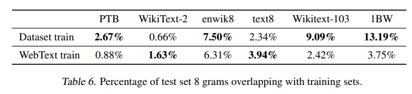

- 본 내용은 사내 발표를 위해 논문 핵심 정리한 내용으로 공유합니다. 부족한 부분은 말씀주시기 바랍니다.

# Language Models are Unsupervised Multitask Learners

# Abstract

language model을 explicit한 supervision 없이 WebText (millions of web pages)를 train 함.

CoQA training dataset 127,000+ 학습 없이 F1 55기록 달성( baseline system 75%)

LM model의 capacity가 zero-shot task transfer의 성공에 중요한 영향 (log-linear 영향)

GPT-2라고 부르는 1.5B parameter의 모델의 경우는 language modeling dataset의 test들에서 zero shot setting에서 87.5%의 SOTA 달성.

자연스럽게 발생하는 것을 배워 tasks에서 성능을 내는 것은 Language processing 에 의미가 있음을 강조.

# Introduction

ML systems은 large datasets, high capacity models, supervised learning 세 가지 조합으로 학습을 가속화해옴.

위의 기조는 task specific하고 data distribution에 민감할 수 밖에 없음.

논문 저자들은 많은 task를 수행하는 일반적인 system에 대해 지향점이 있었음.

대표적으로 Multi task learning, meta-learning perspective 시도들이 있어왔으나, multi task learning의 경우 이를 위해서는 효과적인 training pairs 구성이 필요한 등 부가적인 작업이 많이 필요함.

현재는 pre-training + supervised fine tuning이 flexible한 transfer 방식. 하지만 supervised training이 여전히 필요.

이 논문은 이런 트렌드를 따라가면서 더 일반적인 transfer 방식을 찾았고 zero-shot setting down stream task를 진행해서 이를 보여줌.

# zero-shot task performance of WebText LMs

# Approach

* Core approach is __Language modeling__ => framed unsupervised distribution estimation
* 특정 위치의 확률;p(x) 뿐 아니라 k-1까지가 주어졌을 때 k~ n까지의 확률을 맞추는 것도 가능해야 함.
* 2.1 Training Dataset
  * 기존: single domain (news articles, wikipedia), 논문 저자들은 가능한 다양한 분야와 맥락 수집이 목표.
  * Common crawl => unintelligent, 품질을 위한 filterling => Reddit 이용, 3 karma 이상.
  * WebText : web scrape ,4.5k만 links ,wikipedia 문서 제거, 8만 documents, 40 GB of text

* 2.2 Input Representation
  * 전처리 작업 : lower-casing, tokenization, out-of vocab -> model -able strings.
  * Unicode, UTF-8 사용
  * BPE 사용, base vocabulary 256 (merging 단계에서 character category가 sequence byte 결합되는 것 방지)
* 2.3 Model
  * follows GPT model
  * 약간의 변형 => Layer normalization이 sub-block 앞으로 배치
  * final attention block 이후 Layer normalization 추가
  * initialization 수정, residual weights * 1/ √ N , N : residual layer 개수.
  * vocabulary 50,257
  * 한번에 들어가는 context size 1024 tokens 까지, batch size는 512까지 사용.

# Approach
2.3 해석

# 3. Experiments
3.1 Language Modeling

* WebText LM이 zero-shot task transfer에 성능을 보일지 궁금
  * quantity : prediction unit(character, byte, word) average negative log probability의 exponentiated
  * de-tokenizing을 사용해서 결과를 예측 함, invertible할 때는 log probability을 계산, 2.5/5 ppl
* 3.2 Children’s Book Test
  * acc, named entities, nouns, verbs, prepositions / 10개 단어 중에서 생략된 답변에 가까운 것
  * 여기서는 나머지 문장을 주고 10개 중 높은 choice를 선택하여 accuracy.
* 3.3 LAMBADA
* 3.4 Winograd Schema Challenge
* 3.5 Reading Comprehension
* 3.6 Summarization
* 3.7 Translation
* 3.8 Question Answering

# 3.Experiments
LAMBADA, Reading Comprehension, Question Answering을 중심으로

* LAMBADA
  * test ability to model long-range dependencies in text.
  * Gpt-2’s errors not valid final words => Adding a stop-word filter
  * 이전 SOTA모델의 경우에는 context 안에 답변이 있는 경우만 답변을 예측하도록 제한을 걸었는데, GPT-2모델의 경우 제한하지 않음.
* Reading comprehension
  * context history에 기반한 answer questions
  * achieves 55 F1 , supervised task BERT는 89 F1
  * error를 분석해보니 gpt2가 단순한 검색에 답변 한다는 것을 알 수 있었음.
* Question Answering
  * correct 답변 생성, Natural Questions dataset, context에 question & answer pair
  * GPT-2 4.1% of questions correctly
  * model capacity 주요한 요소=> 5.3 배 더 정확한 대답 (GPT2/ baseline)
  * open domain에서는 GPT2 도 30~50 % 정도의 확률

# 4. Generalization vs Memorization
평가방법을 위한 측정

data의  size가 클수록,  test data가 training dataset에 얼마나 등장하는지 분석하는 것이 중요함.

train과 test dataset가 겹치기 되면 model의 generalization 성능이 over-reporting될 수 있다. => (일반화 성능이 떨어질 수 있음)

이런 부분을 조사하기 위해서 논문에서는 Bloom filters(8-grams) 만들어 성능을 테스트.

WebText LMs를memorization성능 검증을 위해memorization 방향으로 접근할 수 있는데,dataset을 held-out해서

# Discussion & Conclusion

unsupervised task learning 또한 더 탐구할 만한 영역이라는 것을 밝힘.

pre-train - down stream NLP tasks 방향 안에서 supervised adaptation이나 수정 없이 task에 바로 적용.

WebText LMs의 evaluation를 위해 부가적인 tasks이 더 연구되어야 함을 강조.

language model의 경우에는 충분한 capacity를 가졌을 때 baseline보다 더 나은 성능을 낼 수 있음을 확인.

충분히 크고 다양한 데이터셋을 학습한 큰 언어 모델의 경우 도메인에 상관 없이 좋은 성능을 내는 것을 확인.

language modeling dataset의 test 시, 8개 중 7개  sota 달성.

다양한 text corpus의 likelihood 최대화를 목적으로 학습한 high-capacity 모델이 explicit한 supervision 없이도 성능을 잘 낼 수 있음을 보여줌.

# Terms

Multi task learning

ppl : 단어의 수로 정규화 된 테스트 데이터에 대한 확률의 역수

Bloom filter : 원소가 집합에 속하는지 여부를 검사하는 데 사용되는 확률적 자료구조.; m개의 원소로 이루어진 하나의 비트배열 V와 k개의 서로 독립적인 종류의 이산 균등 분포의 해시 함수를 이용한 자료구조. 해시 함수의 경우 각 입력값에 대해 0에서 m-1중 하나를 반환하는 함수.

# Future works

* Gpt-2 dive
  * CBT-CN, LAMBADA test
* Transformer dive
  * ATTENTION INTERPRETABILITY ACROSS NLP TASKS
* Generation
  * CTRL review

