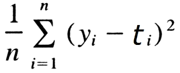

"월간 데이콘 1 반도체 박막 두께 분석"에 참여하면서 모델을 구현해보고 실험해보며 1등이라는 좋은 성과를 얻을 수 있었습니다.
진행했던 고민들을 정리하고 내용을 공유하고자 글을 남깁니다. 더 토론하고 싶은 부분이 있다면 언제든 제 git 주소의 이메일로 연락 주시면 감사하겠습니다. 

## 데이터 설명

layer 1-4 : 박막의 두께
0 ~ 255 : 반사율 스펙트럼, 빛의 파장 등이 비식별화 된 데이터
박막의 두께에 영향을 미칠 수 있는 반사율 스펙트럼이나 빛의 파장 식별 수치들

데이터에 영향을 미칠 수 있는 변수들을 추려 데이터를 만든 과정은 dacon에서 추가로 정보를 공유해주셨습니다.
https://dacon.io/competitions/official/235554/talkboard/400310

## 개발환경

nvcc: NVIDIA (R) Cuda compiler driver
Copyright (c) 2005-2017 NVIDIA Corporation
Built on Fri_Nov__3_21:07:56_CDT_2017
Cuda compilation tools, release 9.1, V9.1.85
NVIDIA-SMI 430.64       Driver Version: 430.64       CUDA Version: 10.1

|   0  GeForce RTX 2080    Off  | 00000000:01:00.0  On |                  N/A |
|  0%   45C    P2    50W / 275W |   1909MiB /  7979MiB |      0%      Default |
+-------------------------------+----------------------+----------------------+
|   1  GeForce RTX 2080    Off  | 00000000:02:00.0 Off |                  N/A |
|  0%   36C    P8    13W / 275W |     11MiB /  7982MiB |      0%      Default |

## 사용했던 Library 및 Data

<pre>
import math
import time
from itertools import chain
import argparse

import numpy as np
import pandas as pd
import torch 
import torch.nn as nn

# for training
from torch.utils.data import Dataset, DataLoader
from tqdm.auto import tqdm

from torch.optim import Optimizer
from torch.optim.lr_scheduler import LambdaLR
</pre>

## 데이터 전처리
### Data Cleansing & Pre-Processing

데이터의 자료형 => 수치로 구성 되어있는 것을 확인했습니다. 
데이터의 컬럼을(변수) 추가하거나 제거하는 등의 노력은 딱히 기울이지 않았습니다. 모델에 맡겼습니다.
데이터를 살펴보았을 때, 정답 라벨인 layer 1-4의 두께가 오름차순으로 정리되어 있었고 그대로 학습하기에는 배치학습 특성상 모델의 편향이 발생될 것이라 판단하여 random 모듈을 사용하여 shuffle 하는 작업을 진행하였습니다.

## 모델 아키텍처
목표 : 예측 모델 구현

128개의 변수로 4개의 변수를 예측하기 위해서는 가장 기본적인 형태의 MLP (멀티퍼셉트론) 아키텍처가 적합하다 여겼고, 베이스 형태로 잡고 아키텍처 구성을 시작했습니다. ( <> 형태 ) 

망은 점점 넓어지는 형태에서 줄어드는 형태로 구성하였고 ((MLP) 2개 이상)), block 마다 활성화 함수를 추가하여 backward 단계에서도 미분 및 업데이트가 가능하도록 설계했습니다. (Linear, activation function, batchnorm) 이 한 block으로 구성하였고 덕분에 여러개를 쌓아서 최적화 시키면, 결과를 예측할 수 있는 근사 함수를 만들수 있도록 신경망 알고리즘을 활용했습니다.

학습 중, 망을 늘리고 깊게 할수록 이전의 정보가 다음 정보로 가는데 추가적인 설계가 필요하다 생각되어 팀원들과 Skipconnection을 적용했습니다.
각 layer 마다 skip connection를 정의하고 다음 layer의 input에 흘러갈 수 있도록 아키텍처를 설계했습니다.

+ 학습을 하면서 Batch normalization을 사용해서 batch마다의 학습 변동 추이를 줄이도록 설계했습니다.
또 변수들을 망에 학습시킬 때, Layer Normalization을 사용하여 계산의 속도를 높일 수 있도록 조정했습니다.
skip connection을 진행할때마다 node에 맞게 feature의 normalization을 진행할 수 있었고, 실제로 10 epoch 안에 loss가 150에서 1로 떨어지는 결과를 얻을 수 있었습니다.
+ 활성화 함수의 경우, 기본적으로 ReLU 함수를 사용해서 다음 layer로 값을 전달할 때, 0 미만은 값을 변형하고 0 이상은 그대로 값을 사용하도록 했다. 

추가로 0 미만의 값에 대해서도 좀 더 활용해보고자 ReLU함수를 조금 변형한 GeLU 함수를 정의해서 실험했다.

<pre>
class skipConnectionModel(nn.Module):
    def __init__(self):
        super(skipConnectionModel, self).__init__()
        
        self.ln = LayerNorm(10000)
        self.ln1 = LayerNorm(7000)
        self.ln2 = LayerNorm(4000)
        self.ln3 = LayerNorm(2000)
        
        self.upblock1 = nn.Sequential(nn.Linear(226, 2000),GELU(),nn.BatchNorm1d(2000))
        self.upblock2 = nn.Sequential(nn.Linear(2000,4000),GELU(),nn.BatchNorm1d(4000))
        self.upblock3 = nn.Sequential(nn.Linear(4000,7000), GELU(),nn.BatchNorm1d(7000))
        self.upblock4 = nn.Sequential(nn.Linear(7000,10000),GELU(),nn.BatchNorm1d(10000))

        self.downblock1 = nn.Sequential(nn.Linear(10000, 7000),GELU(),nn.BatchNorm1d(7000))
        self.downblock2 = nn.Sequential(nn.Linear(7000, 4000),GELU(),nn.BatchNorm1d(4000))
        self.downblock3 = nn.Sequential(nn.Linear(4000, 2000),GELU(),nn.BatchNorm1d(2000))
        self.downblock4 = nn.Sequential(nn.Linear(2000, 300),GELU(),nn.BatchNorm1d(300))
        
        self.fclayer = nn.Sequential(nn.Linear(300,4))
        self.dropout = nn.Dropout(0.1)
        
    def forward(self, x):
        upblock1_out = self.upblock1(x)
        upblock2_out = self.upblock2(upblock1_out)
        upblock3_out = self.upblock3(upblock2_out)
        upblock4_out = self.upblock4(upblock3_out)
        
        downblock1_out = self.downblock1(self.ln(upblock4_out))
        skipblock1 = downblock1_out + upblock3_out
        downblock2_out = self.downblock2(self.ln1(skipblock1))
        skipblock2 = downblock2_out + upblock2_out
        downblock3_out = self.downblock3(self.ln2(skipblock2))
        skipblock3 = downblock3_out + upblock1_out
        downblock4_out = self.downblock4(self.ln3(skipblock3))
        
        output = self.fclayer(downblock4_out)
        
        return output
</pre>

## 목적 함수
test 결과를 MAE로 판단합니다.
따라서 학습시에도 실제 정답 값들 (layer 4개)과 추정 값들의 거리를 재는 MAE loss를 사용하였습니다.
실제로 torch에서는 nn.L1loss로 구현되어 있기 때문에 이를 사용하였습니다. 예측하는 변수가 4개인데 torch에서는 자동으로 계산하여 차이를 최적화합니다.

## 모델 학습

다양한 파라미터들을 바꿔보면서 학습이 잘 되는지 실험했습니다.
- learning rate 조정
 - 처음에는 le-04 정도의 learning rate가 가장 효과적이었습니다.
   개인적으로 Adam과 epoch이 진행됐을 경우, learning rate를 추가로 decaying 하여 감소시키는 방법을 따랐습니다. 
<pre>

def update_lr(optimizer, lr):
    for param_group in optimizer.param_groups:
            param_group['lr'] = lr
</pre>

차후에는 torch에 구현되어있는 AdamW optimizer와 scheduler를 사용하면서 learning rate 를 1e-03로 좀 더 크게 잡고 학습했을 때, 더 학습이 잘 되었습니다.
- optimizer 조정
 - 기존 SGD (batch gradient descent) 보다 발전된 형태인 Adam optimizer를 사용했습니다.
 - 모델 특성 상, 학습이 빨리 진행되는 경우가 많았고 10 epoch 이상부터는 loss가 1 이하에서 감소되는 경향을 보였기 때문에 
- scheduler의 조정
 - loss가 1이하로 내려가서 학습할 경우, 특정 범위 이상 더이상 내려가지 않는 현상 발생 => 스케줄러 조정을 통해서 해결
 - warmup linear scheduler > warmp up cosine scheduler > warmup with hardstart cosine scheduler  => 코사인 스케줄러 특성상 loss가 줄어들시, 더 미세하게 조정해서 실제로 학습 loss 및 val loss를 근소하게 줄일 수 있었습니다.

## 모델 검증 

1차적으로 처음 81000개 train set 중 10000개를 validation set으로 구성해서 학습시 overfitting이 나고 있는지 판단할 수 있도록 코드를 작성했습니다.
epoch마다 돌면서 확인할 수 있도록 해서 지속적으로 확인할 수 있었습니다.

특정 loss 감소 모니터링 후, 30 > 50 > 70 > 100 > 150 > 200 > 250 epoch을 늘려가면서 loss의 추이를 살펴보았습니다.
실질적으로 test score를 측정했을 때, val loss와 거의 흡사함을 확인할 수 있었고 이는 대회에서 성능을 내는데 큰 도움이 됐습니다.

## 결과
결과를 csv 파일로 쓴 후, 추가로 기존에 잘 나왔던 부분을 고려하고자 따로 MAE 함수를 정의해서 비교할 수 있도록 했습니다.

<pre>
def mae(best_path, my_path):
    best = pd.read_csv(best_path)
    best_value = best.iloc[:,1:].values

    value = pd.read_csv(my_path)
    my_value = value.iloc[:,1:].values

    abs_value = abs(best_value - my_value)
    size = abs_value.shape
    return sum(sum(abs_value)) / (size[0]*size[1])

</pre>

대회에 제출할 때는 bagging 형식의 평균 앙상블 전략을 취해서 단일 모델로는 0.41 정도의 mae를 가지는 모델을 0.32(최종기록)까지 떨어트릴 수 있었습니다.
앙상블 할 때, 모델의 망 구성을 변형한 것도 있었고 하이퍼 파라미터 조정을 통해서 다르게 구성한 모델도 있었습니다.

정리하면, 어떻게 보면 간단하다 생각했었던 머신러닝 예측 모델을 만들어보면서 생각하고, 또 적용해서 실험해보면서 많은 것들을 배울 수 있었습니다.
수치형 데이터 자료들로 ( 일정 범위를 가지는 연속형 수치) 예측 모델을 만들어보았고 일정 수준의 결과를 도출해본 경험을 토대로 다른 연속형 수치 자료들도 근사할 수 있는 모델을 꾸준히 만들어볼 계획입니다. 현재 있는 모델에서 다양한 MLP 형태를 변형하여 근사함수를 만들어보실 분, 환영합니다! 
